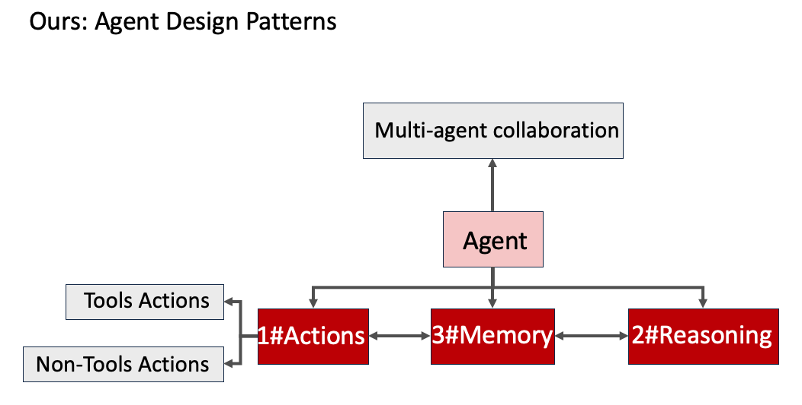

# LLM-Agent-Papers-Collection
A collection of **papers** on Large Language Model Agents

Our collection of papers focuses on various aspects of ***LLM-Agent Design Patterns***. The design patterns can be abstracted and illustrated as shown in the figure below. The collection is categorized into actions, memory, reasoning, agents, and multi-agent collaboration.

Besides the aspects shown in the figure, this repository will also include: overview of LLM-Agent, benchmarks, prompt design.

# Agent Design Patterns

## Actions

1. [Tulip Agent -- Enabling LLM-Based Agents to Solve Tasks Using Large Tool Libraries](https://arxiv.org/abs/2407.21778) 2024.7

## Memory

## Reasoning

1. [ AgentGen: Enhancing Planning Abilities for Large Language Model based Agent via Environment and Task Generation](https://arxiv.org/abs/2408.00764) 2024.8

## Agent

## Multi-agent Collaboration

1. [Experiential Co-Learning](https://arxiv.org/abs/2312.17025) ACL2024

# Additional Topics Covered

## Overview of LLM-Agent

## Benchmarks

1. [OlympiadBench: A Challenging Benchmark for Promoting AGI with Olympiad-Level Bilingual Multimodal Scientific Problems.](https://github.com/OpenBMB/OlympiadBench) ACL2024

## Prompt Design

# Continuous Updates

This repository will be continuously updated as new research on LLM Agents is conducted. Stay tuned for the latest papers, benchmarks, and innovations in the field.
